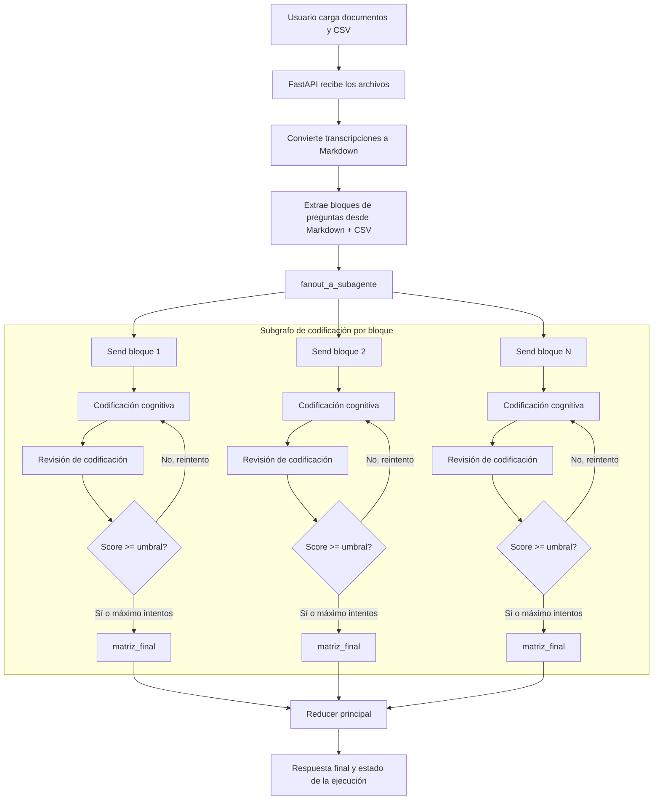

# Workflow Cognitivas

Aplicación web en Python para apoyar la codificación de entrevistas cognitivas a partir de transcripciones, una pauta CSV y un contexto de estudio. La interfaz permite cargar archivos, convertir documentos a Markdown y ejecutar un workflow con agentes que extraen bloques de preguntas, codifican cada bloque y revisan la calidad de la codificación antes de consolidar el resultado final.

## Qué es y qué hace

Este proyecto expone una app con FastAPI y una interfaz HTML/Jinja para:

- subir transcripciones en `.pdf`, `.doc` o `.docx`
- subir una pauta en `.csv`
- convertir los documentos a Markdown
- ejecutar un grafo de trabajo con LangGraph
- codificar preguntas evaluadas y sondeos con ayuda de modelos de OpenAI
- revisar la calidad de la codificación y consolidar una matriz final
- consultar el estado del proceso desde la interfaz o por API

La lógica principal vive en `app/workflow/` y el frontend en `app/templates/` y `app/static/`.

## Cómo se ejecuta

### Requisitos

- Python 3.13
- `uv`
- una clave de OpenAI disponible en el entorno, por ejemplo en un archivo `.env`

### Instalación recomendada con `uv`

```bash
uv sync
```

### Levantar la aplicación

```bash
uv run uvicorn app.main:app --reload
```

Luego abre:

- `http://127.0.0.1:8000/` para la página principal
- `http://127.0.0.1:8000/config` para la pantalla de configuración y carga

### Observabilidad opcional

Si quieres ver trazas con Phoenix, puedes levantarlo con:

```bash
bash observabilidad/start_phoenix.sh
```

La app intenta enviar trazas a `http://localhost:6006/v1/traces` cuando Phoenix está disponible.

## Estructura general del proyecto

```text
app/
  main.py                  # API, UI y disparo del workflow
  templates/               # Vistas HTML
  static/                  # CSS y otros recursos estáticos
  workflow/                # Grafo principal, subgrafo y conversiones
observabilidad/            # Script para levantar Phoenix usando docker
pyproject.toml             # Dependencias y metadatos del proyecto
uv.lock                    # Lockfile de dependencias
```

Dentro de la ejecución, el proyecto usa estas carpetas de trabajo:

```text
app/docs/transcripciones   # documentos cargados por el usuario
app/docs/csv               # pauta CSV
app/docs/markdown          # conversiones a Markdown
```

## Flujo general del grafo



## Notas de uso

- El flujo espera al menos un documento cargado en `app/docs/transcripciones/` y un CSV en `app/docs/csv/`.
- El contexto del estudio se envía desde la interfaz antes de iniciar la codificación.
- Si un archivo ya existe con el mismo hash, la carga se rechaza como duplicado.

## Licencia y autoría

Este proyecto fue creado originalmente por Jona-S99.

El código se distribuye bajo licencia MIT. Puedes usarlo, copiarlo,
modificarlo y distribuirlo, siempre que conserves el aviso de copyright y la
licencia incluida en este repositorio. Revisa `LICENSE` y `NOTICE` para más
detalle.
